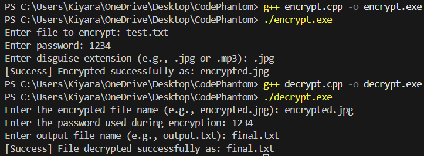
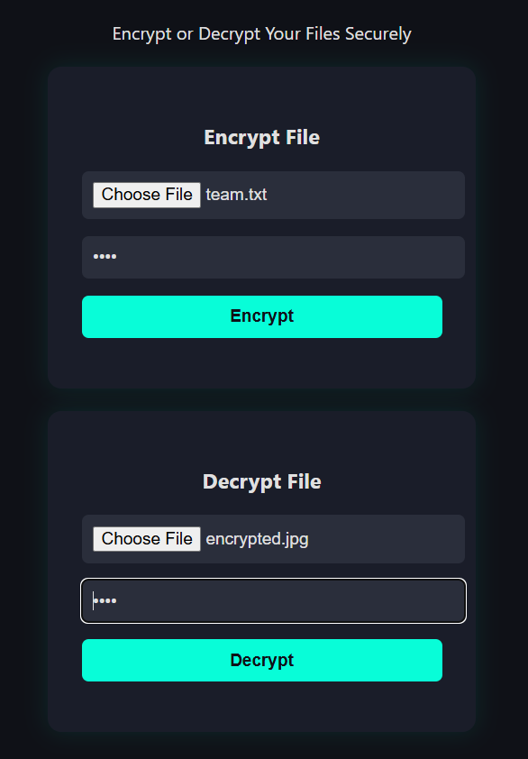

# 🔐CodePhantom

A simple C++-based file encryption and decryption tool with a clean frontend using HTML & CSS.

## 💡 Features
- Encrypt any file using XOR and password
- Disguises encrypted files as .jpg, .mp3, etc.
- Decrypt using the same password
- Lightweight frontend for UI interaction

## 🛠️ Tech Stack
- C++
- HTML
- CSS
- GitHub

## 👩‍💻 How to Run
1. Compile encrypt.cpp → Run encrypt.exe
2. Compile decrypt.cpp → Run decrypt.exe
3. Open index.html in browser for UI

## 🌐 Team CodePhantom
- Kiyara [https://github.com/kiyara17777]  (Frontend, Encryption)
- Janhvi [https://github.com/janhvi-crypto] (Frontend, Decryption)

## 📁 Assets
Logo: /assets/logo.png

📸 Demo Screenshots

### 🔒 Encryption in CLI
Encrypt AND Decrypt files using password-based XOR encryption via terminal interface:

### 🌐 User Interface (HTML + CSS)
Simple UI for users to interact with the tool (dark mode included): 

